#### 📊 Task 1: System Monitoring Script

##### 📝 Overview
This Bash script monitors system resources such as CPU, memory, disk usage, and running processes. It logs information in a designated directory and sets up a cron job to run the script automatically.

##### ✨ Features
- 📁 Creates a log directory (`/var/log/system_monitor`) for storing logs
- 🔍 Checks if required utilities (`nmon`, `htop`, `df`, `du`, `ps`) are installed and installs missing ones
- 📈 Monitors CPU and memory usage using `htop` and `nmon`
- 💾 Logs disk usage details
- ⚠️ Captures high CPU and memory-consuming processes
- ⏱️ Configures a cron job to run the script periodically

#### 🔄 Script Breakdown

##### 1️⃣ Variable Initialization 📌
```bash
LOG_DIR="/var/log/system_monitor"
SYSTEM_REPORT_LOG=$LOG_DIR/system_report.log
HIGH_CPU_PROCESSES_LOG=$LOG_DIR/high_cpu_processes.log
HIGH_MEMORY_PROCESSES_LOG=$LOG_DIR/high_memory_processes.log
DISK_USAGE_LOG=$LOG_DIR/disk_usage.log
CPU_MEMORY_USAGE_LOG=$LOG_DIR/cpu_memory_usage.log
DIRECTORY_USAGE_LOG=$LOG_DIR/directory_usage.log
TIMESTAMP=$(date "+%Y-%m-%d %H:%M:%S")
SCRIPT_PATH="/root/system_monitor.sh"
```
- 📋 Defines the log directory and file paths for various logs
- 🕒 `TIMESTAMP` captures the current date and time for logging
- 📂 `SCRIPT_PATH` specifies the location of this script (used later for cron)

##### 2️⃣ Root Privilege Check 🔐
```bash
if [[ ${UID} -ne 0 ]]; then
    echo "Please run with sudo or as root"
    exit 1
fi
```
- 👮 Ensures the script is run as root (UID 0). If not, it exits with an error message

##### 3️⃣ Log Directory Management 📂
```bash
if [ ! -d "$LOG_DIR" ]; then
    mkdir -p $LOG_DIR || {
        echo "Error: Cannot create $LOG_DIR" >&2; exit 1;
    }
    chmod 750 $LOG_DIR
fi

if [ ! -w "$LOG_DIR" ]; then
    echo "Error: No write permission for $LOG_DIR. Adjust permissions or run with sudo." >&2
    exit 1
fi
```
- 🔍 Checks if the log directory exists; if not, creates it with `mkdir -p`
- 🔒 Verifies root privileges before creating the directory
- 🛡️ Sets permissions to `750` (read/write/execute for owner and group)
- ✅ Ensures the directory is writable; otherwise, exits with an error

##### 4️⃣ Dependency Check and Installation 🔧
```bash
for package in nmon htop; do
    if ! command -v "$package" &>/dev/null; then
        echo "$package is not installed. Attempting to install..."
        sudo apt-get update && sudo apt-get install -y "$package" || {
            echo "Error: Failed to install $package" >&2
            exit 1
        }
    fi
done
```
- 🔍 Ensures `nmon` and `htop` are installed for monitoring purposes
- 📦 Checks if each tool is installed; if not, installs it using `apt-get`

##### 5️⃣ Core Utility Verification ⚙️
```bash
for tool in df du ps; do
    if ! command -v "$tool" >/dev/null 2>&1; then
        echo "Error: Core utility $tool not found" >&2
        exit 1
    fi
done
```
- 🧰 Checks for the presence of `df`, `du`, and `ps` commands

##### 6️⃣ System Report Initialization 📝
```bash
{
    echo "===================="
    echo "System Report - $TIMESTAMP"
    echo "===================="
} > $SYSTEM_REPORT_LOG
```
- 📄 Creates/overwrites the `system_report.log` file with a header and timestamp

##### 7️⃣ CPU and Memory Usage Monitoring 💻
```bash
TERM=xterm htop -C -d 10 -n 1 > $CPU_MEMORY_USAGE_LOG
nmon -f -s 10 -c 6 -m $LOG_DIR &
echo "[CPU & Memory Usage Logged]" >> $SYSTEM_REPORT_LOG
```
- 📊 Runs `htop` non-interactively to log CPU/memory usage once (`-n 1`) with a 10-second delay (`-d 10`)
- 📈 Runs `nmon` in the background to capture 6 snapshots every 10 seconds, saving output to the log directory
- ✅ Appends a confirmation message to the system report

##### 8️⃣ Disk Usage Monitoring 💾
```bash
df -h > $DISK_USAGE_LOG
echo "[Disk Usage Logged]" >> $SYSTEM_REPORT_LOG
du -sh /var/* > $DIRECTORY_USAGE_LOG
echo "[Directory Usage Logged]" >> "$SYSTEM_REPORT_LOG"
```
- 💿 Logs disk usage in human-readable format (`df -h`) to `disk_usage.log`
- 📂 Logs the size of directories under `/var` to `directory_usage.log`
- ✅ Appends confirmation messages to the system report

##### 9️⃣ Process Monitoring ⚙️
```bash
ps aux --sort=-%cpu | head -10 > $HIGH_CPU_PROCESSES_LOG
echo "[High CPU Usage Processes Logged]" >> $SYSTEM_REPORT_LOG

ps aux --sort=-%mem | head -10 > $HIGH_MEMORY_PROCESSES_LOG
echo "[High Memory Usage Processes Logged]" >> $SYSTEM_REPORT_LOG
```
- 🔥 Logs the top 10 CPU-intensive processes to `high_cpu_processes.log`
- 📊 Logs the top 10 memory-intensive processes to `high_memory_processes.log`
- ✅ Appends confirmation messages to the system report

##### 🔟 Setup Cron Job for Automation ⏱️
```bash
TEMP_CRON=$(mktemp)
crontab -l > "$TEMP_CRON" 2>/dev/null || true

if ! grep -q "$SCRIPT_PATH" "$TEMP_CRON"; then
    echo "Setting up automatic cron job for system monitoring..."
    echo "0 * * * * $SCRIPT_PATH" >> "$TEMP_CRON"
    crontab "$TEMP_CRON"
    echo "Cron job added: Runs every hour."
else
    echo "Cron job already exists. No changes made."
fi

rm "$TEMP_CRON"
```
- 🕒 Creates a temporary file to hold the current crontab
- 🔍 Checks if the script is already in the crontab; if not, adds it to run every hour (`0 * * * *`)
- 🧹 Cleans up the temporary file

##### 1️⃣1️⃣ Verify Current Crontab 📋
```bash
echo "Current crontab:"
crontab -l
```
- 👁️ Displays the active crontab

#### 📋 Usage Instructions
1️⃣ 💾 Copy and save the script as `system_monitor.sh`
2️⃣ 🔓 Make the script executable:
   ```bash
   chmod +x system_monitor.sh
   ```
3️⃣ 🚀 Run the script with sudo:
   ```bash
   sudo ./system_monitor.sh
   ```
4️⃣ 🔍 Verify logs in `/var/log/system_monitor/`:
   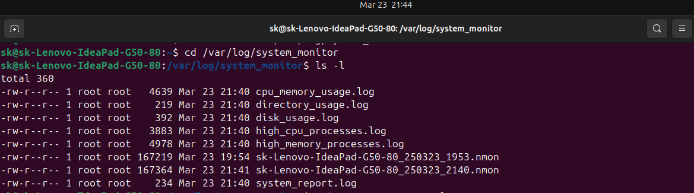
   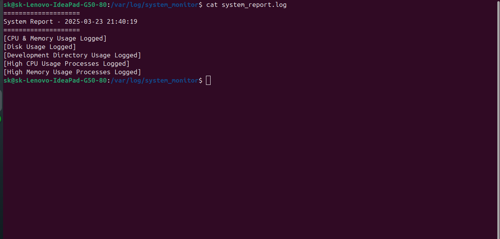
   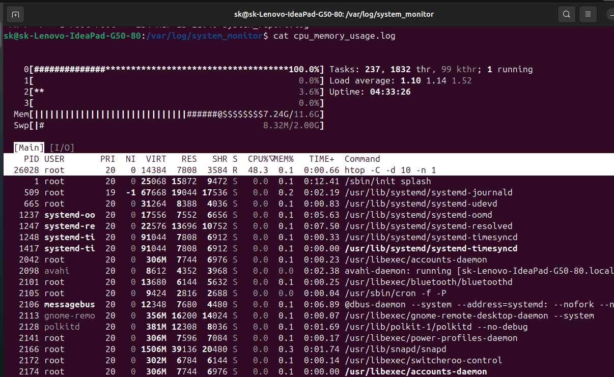
   
   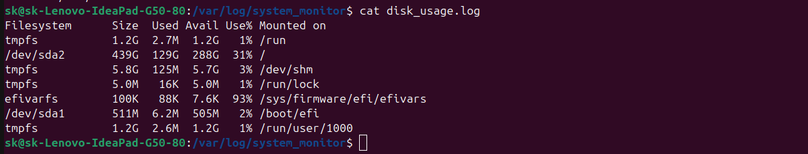
   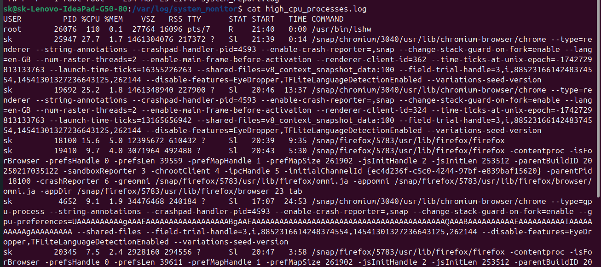
   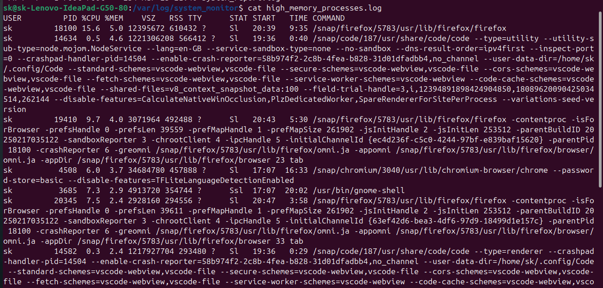
5️⃣ 📊 Check cron jobs using:
   ```bash
   crontab -l
   ```

---

## **Task 2: User Management and Access Control**

### **Objective:**
- Create user accounts for Sarah and Mike.
- Assign isolated directories.
- Enforce password policies.

### **Implementation Steps:**

1. **Create and Validate User Accounts.**
```bash
# Add new users
sudo adduser sarah
sudo adduser mike

# Set secure passwords
sudo passwd sarah
sudo passwd mike

# Verify user creation
id sarah
id mike
```


2. **Create Isolated Directories.**
```bash
# Create workspace directories
sudo mkdir -p /home/sarah/workspace
sudo mkdir -p /home/mike/workspace

# Set ownership
sudo chown sarah:sarah /home/sarah/workspace
sudo chown mike:mike /home/mike/workspace

# Restrict permissions
sudo chmod 700 /home/sarah/workspace
sudo chmod 700 /home/mike/workspace
```

3. **Enforce Password complexity Policies.**
```bash
# Edit the password complexity rules
sudo nano /etc/security/pwquality.conf

# Add the following configuration
minlen = 12               # Minimum password length
minclass = 3              # At least 3 character classes (uppercase, lowercase, digits, symbols)
maxrepeat = 3             # Prevent consecutive repeating characters
retry = 3                 # Allow 3 retries before failure

# Enable complexity enforcement
sudo nano /etc/pam.d/common-password

# Ensure this line is present
password requisite pam_pwquality.so retry=3
```

4. **Enforce Expiration Policy.**
```bash
# Edit the password policy settings
sudo nano /etc/login.defs

# Add or modify the following lines:
PASS_MAX_DAYS   30      # Password expires after 30 days
PASS_MIN_DAYS   1       # Minimum 1 day between password changes
PASS_WARN_AGE   7       # Warn users 7 days before expiration

# Apply the policy to the new users
sudo chage -M 30 -m 1 -W 7 sarah
sudo chage -M 30 -m 1 -W 7 mike
```
5. **Screenshots.**
   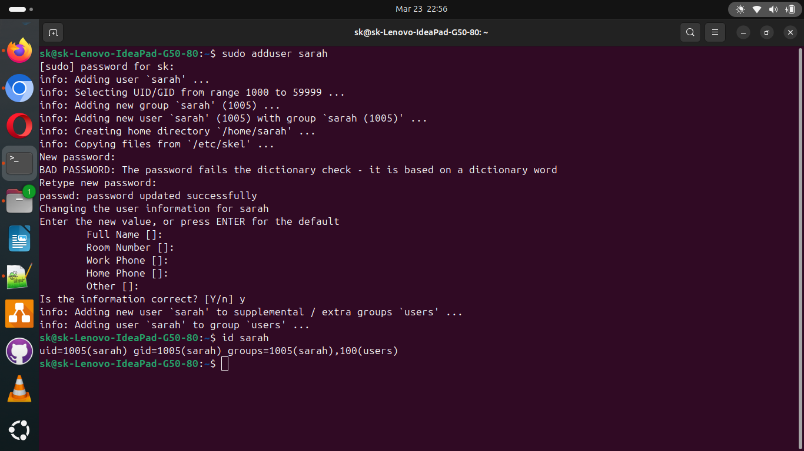
   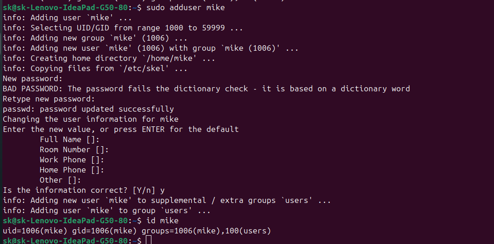
   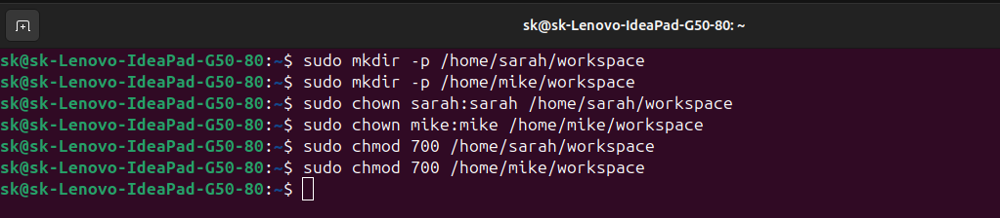
   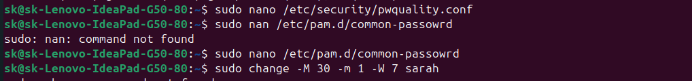
   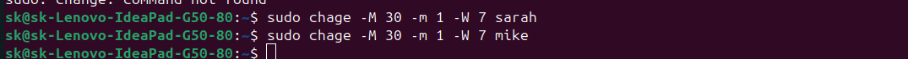
   

